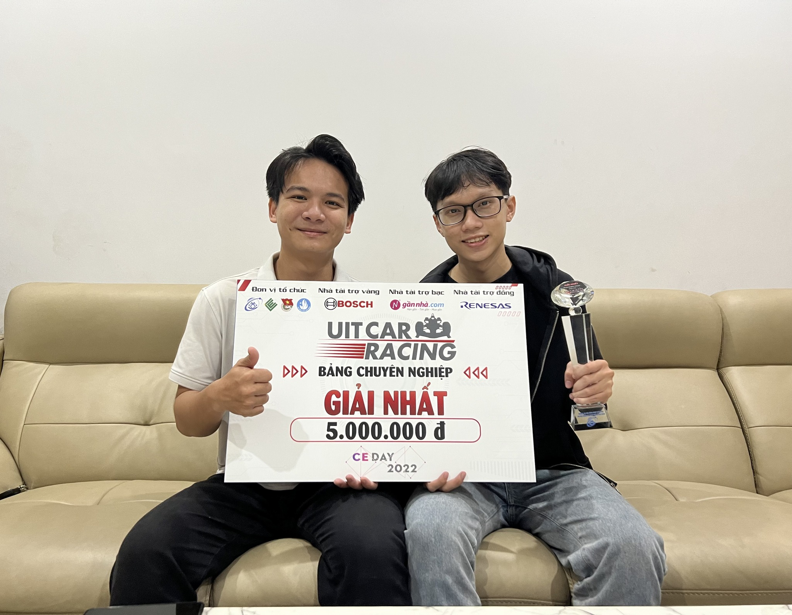
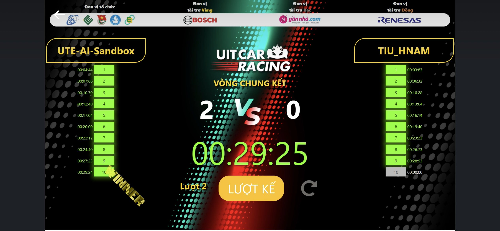
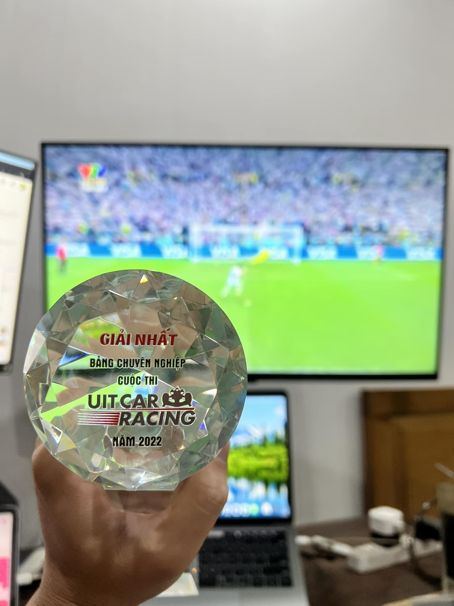

# UIT CAR RACING 2022 - Final Round

## <div align="center">Awards 👨‍💻</div>
<p align="center">
 
</p>

## <div align="center">🏎️ Score Board 🏎️</div>
<p align="center">
 
</p>

## <div align="center">Trophy 🏆</div>
<p align="center">
 
</p>

## <div align="center">Requirements</div>
- [References](https://github.com/vantin2912/UITCar2022).
- [Setup Board](https://github.com/dotrannhattuong/UIT_Car_Racing_2022/tree/main/setup_board).

## <div align="center">Inference</div>
```
cd ./Recognition
sh run.sh
```

## <div align="center">Dataset</div>
- [Segmentation](https://github.com/dotrannhattuong/UIT_Car_Racing_2022/tree/main/dataset/segmentation).
- [Object Detection](https://github.com/dotrannhattuong/UIT_Car_Racing_2022/tree/main/dataset/object_detection).
- [Classification](https://github.com/dotrannhattuong/UIT_Car_Racing_2022/tree/main/dataset/classification).

## <div align="center">Training</div>
- [Unet](https://github.com/dotrannhattuong/UIT_Car_Racing_2022/tree/main/notebook/segment).
- [Object Detection](https://github.com/dotrannhattuong/UIT_Car_Racing_2022/tree/main/notebook/object_detection).
- [Classification](https://github.com/dotrannhattuong/UIT_Car_Racing_2022/tree/main/notebook/classification).

## <div align="center">Controller</div>
[Code](https://github.com/dotrannhattuong/UIT_Car_Racing_2022/blob/main/Recognition/controller.py)

## <div align="center">Idea</div>
- Sử dụng file UITCar.py không có getPosition_rad() để tăng tốc độ xử lý
- Áp dụng Linear Function để điều khiển tốc độ
- Sử dụng timer để cua mù biển báo 
- Sử dụng độ rộng đường để cua biển báo (Ưu điểm với các đội khác) => cua thành công 100% (xét trong trường hợp detect đúng biển báo)

## <div align="center">Experiments</div>
- Chú ý vị trí đặt camera
- Chú ý phải đo lại thường xuyên độ rộng đường
- Thông số PID
- Line ngang
- Xem xét xem sân có thể có trường hợp line đứt hay không?

## <div align="center">References</div>
- Round 1_2: https://github.com/Syun1208/uit-car-racing-2022/tree/it-car/final_round
- CEEC: https://github.com/vantin2912/UITCar2022