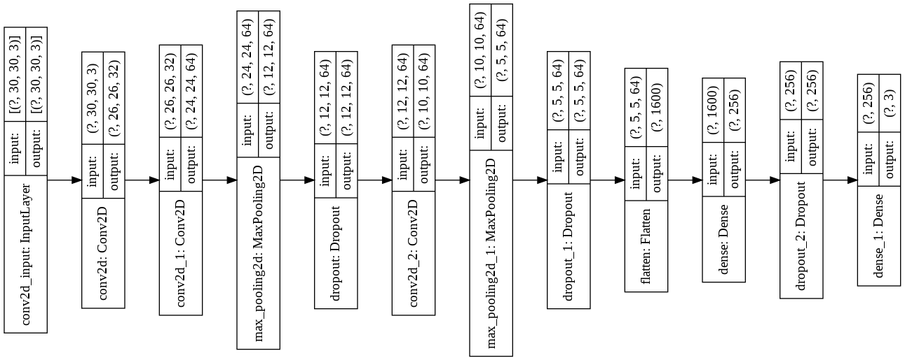

## Traffic Sign Classification

### Network Architecture



## Data
[Dataset No Straight](https://github.com/dotrannhattuong/UIT_Car_Racing_2022/tree/main/dataset/classification/data_no_straight)
```
class_name = ['thang', 'trai', 'phai', 'camtrai', 'camphai']
```

### Training
```
python CNN.py
```

## Note: Training với 5 class (không có class No_Straight theo quy định BTC)

## Nhận xét: Training không có class None -> Performance cao hơn. Nhưng lúc Inference phải có class None cho trường hợp không có box khi qua model CNN